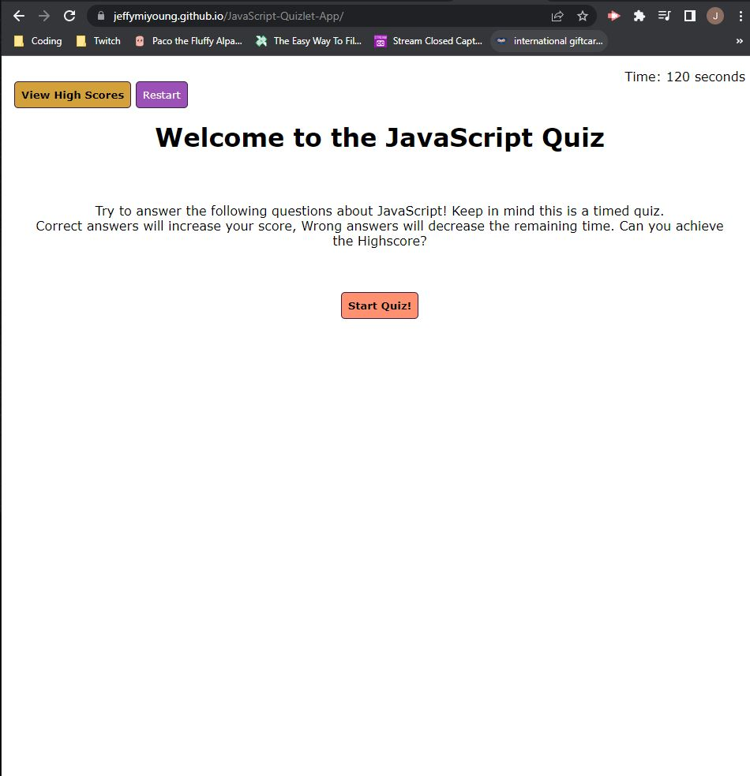

# JavaScript Quiz Web Test
What is your current knowledge on JavaScript? As a developer, I wanted to create an application that could test the user's current knowledge on what they know/don't know about the subject! Through a series of mulitple choice questions, you'll find out if you've made the Highscore roster with your provided answers!

## Technologies:
* HTML (Basic Layout)
* CSS (Styling)
* JavaScript (Primary Function)

## How To:
Press the `Start` Button after reading the introduction paragraph, and you'll see your first question appear! Answer all 10 questions (console will reveal if you're right or wrong), to see your final score! Input your initials (up to 5 characters), to be put in our Highscore Roster! Did you make the cut?

Press the `Restart` Button, if you'd like to restart on your progress and do it all over again!

Press the `View Highscore` Button, if you'd like to see whose on the current Highscore Roster!

## Screenshot:

## Author(s):
* Jeffrey Young

## Contact Info:
Jeffrey Young: https://github.com/jeffymiyoung

---
© 2022 JavaScript Quiz Web Test Application
